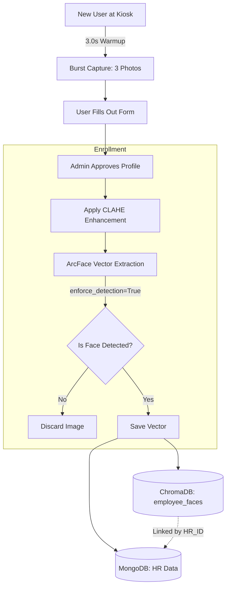
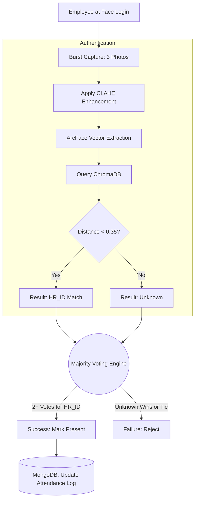
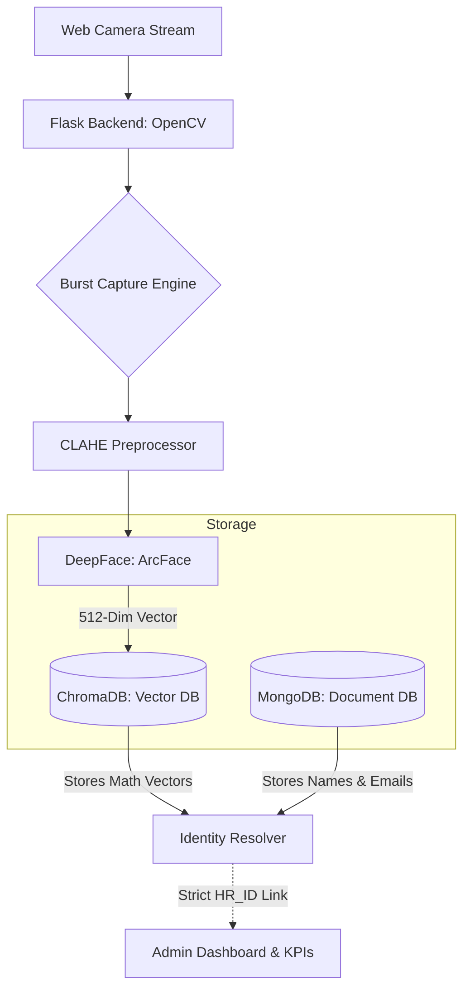

# 🛡️ Elgoss Visitor & Employee Management System

## 1. Short Description

Welcome to the **Elgoss Visitor & Employee Management System**! This is a smart, AI-powered web application that uses advanced facial recognition to automatically mark employee attendance and securely track visitors. We built this to completely remove the need for manual registers and ID cards.

---

## 2. Problem Statement & Objective

**The Problem:** 
Even today, many offices rely on manual paper registers or fingerprint scanners. Paper logs are slow, hard to search, and easy to fake. On the other hand, fingerprint scanners can be unhygienic and often cause long queues during morning rush hours. 

**Our Objective:** 
We wanted to build a fast, touchless, and highly secure AI solution. Our system instantly recognizes an employee's face to mark their entry/exit and seamlessly registers visitors. This makes the workplace modern, safe, and fully automated.

---

## 3. Technologies Used

We used a mix of powerful and modern tools to bring this project to life:
*   **Frontend:** HTML, CSS, JavaScript (Bootstrap/Tailwind) for a clean user interface.
*   **Backend:** Python & Flask (to handle the server logic)
*   **Artificial Intelligence:** OpenCV & DeepFace (using the ArcFace model for highly accurate face detection)
*   **Databases & Collections Used:**
    *   **MongoDB (NoSQL Database):** Used to store all structured data, logs, and user details. The following collections are created in our cluster:
        *   `users` / `employees`: Stores registered employee details (Name, Email, Job Role, HR ID, etc.).
        *   `visitors`: Stores temporary visitor details (Name, Phone, Purpose, Host Name, etc.).
        *   `attendance`: Tracks real-time employee entry and exit times with working hours.
        *   `security`: Manages login credentials for the admin and security personnel.
        *   `universal_registry`: A shadow centralized log for comprehensive auditing.
    *   **ChromaDB (Vector Database):** A special AI database used to store and quickly search facial embeddings (the mathematical version of a face). The following collections are utilized:
        *   `employee_faces`: Stores vector data of all enrolled employees for high-speed matching.
        *   `visitor_faces`: Stores temporary face vectors for guests.
        *   `other_faces`: Stores face vectors for external staff or contractors.

---

## 4. Key Features

*   **Instant Face Authentication:** Marks employee entry and exit in milliseconds without anyone needing to touch a machine.
*   **Multi-Shot Enrollment:** Captures multiple angles of an employee's face (3 pictures at the time of bulk enroll of employee) during registration to ensure 100% accuracy, grouping them perfectly in the backend.
*   **Visitor Tracking:** Easily captures visitor details along with their photo to keep a secure digital record of guests.
*   **Smart Storage Auto-Cleanup:** Automatically deletes temporary live camera captures after successfully marking attendance, so the computer's hard drive never gets full.
*   **Role-Based Access Control:** Separate, secure login portals for the 'Admin' and 'Security Guard' with different privileges and views.
*   **Real-Time Admin Dashboard:** A live panel for admins and security guards to monitor who is currently inside the building and manage employee data and also shows entry time, exit time and working hour of an employee.

---

## 5. Login Details & Workflow
To maintain high security, the system employs a strict role-based login mechanism dividing responsibilities between the Administrator and the Security Guard.

**How the Login Flow Works:**
1. **Authentication:** When a user opens the web portal, they are prompted with a secure login page. The credentials entered are verified against the `security` collection in MongoDB.
2. **Role Verification:** The system checks the user's assigned role (`admin` or `security`).
3. **Redirection (Admin Flow):** If the user is an **Admin**, they are granted full access to the backend system. They can view the comprehensive real-time dashboard, bulk-enroll new employees, manage/delete existing data, and view detailed attendance/visitor history logs.
4. **Redirection (Security Flow):** If the user is a **Security Guard**, they are redirected to a more restricted, front-line interface. Their primary dashboard focuses on immediate tasks: registering walk-in visitors, generating temporary passes, and observing live entry/exit camera feeds without access to delete sensitive data.

---

## 6. System Architecture & Complete Working Flow
Here is the step-by-step breakdown of how the entire system operates, from the moment a user logs in, to how data is managed across different dashboards.

### Step 1: Secure Role-Based Login
The very first screen is a secure login portal.
*   **Authentication:** The user enters their credentials, which are verified securely against the MongoDB `security` collection.
*   **Role Routing:** The system identifies if the person logging in is an **Admin** or a **Security Guard** and instantly redirects them to their respective dedicated dashboards.

### Step 2: The Security Dashboard (Front-Line Operations)
When the Security Guard logs in, they see a specialized dashboard designed for fast, front-desk tasks. It has the following key sections:
*   **Live Camera / Face Scan:** This is the main screen where the camera actively looks for faces. When a person stands in front of it, the DeepFace AI converts their face into numbers and searches the ChromaDB database.
    *   *If it's an Employee:* The system flashes a green success screen and automatically logs their "Entry" or "Exit" time in the database.
    *   *If it's an Unknown Face:* The system alerts the guard that this is an unregistered person and opens a registration form for enrollment. The guard fills out the registration form and submits it. After submission, a notification is sent to the admin dashboard; if the admin accepts the request, the person is successfully enrolled in the system.
*   **Visitor Registration:** If a visitor arrives, the guard uses this section. A form pops up to capture the visitor's Name, Phone, Host Name, and Purpose. The camera takes their live photo, saves their face data in `visitor_faces`, and generates a digital Visitor Pass.
*   **Today's Logs:** The guard can view a quick, read-only list of everyone who entered or exited today to keep track of the current building status.

### Step 3: The Admin Dashboard (Backend Management)
When the Administrator logs in, they get full, unrestricted access to the entire system. The Admin dashboard includes:
*   **Real-Time Analytics Overview:** The home screen shows live statistics, like the total number of employees enrolled, visitors present today, and recent activity logs.
*   **Employee Bulk Enrollment:** The admin can register new employees. The system captures multiple photos of the employee's face from different angles, creating a highly accurate AI profile stored in ChromaDB.
*   **Manage Employees:** A complete list of all enrolled staff. The admin can view details, see how many photos are enrolled per person, edit their roles, or permanently delete an employee (which safely removes their face data and physical files).
*   **Universal Registry & Auditing:** The admin can access deep, centralized logs showing the complete history of every entry and exit for both visitors and employees across any date.

---

## 7. Advanced Biometric AI Architecture

This system uses a highly robust, multi-dimensional profile mapping to guarantee zero false-positives and extreme accuracy under any lighting condition.

### 7.1 First Time Architecture (Enrollment)

When an employee or visitor uses the kiosk for the very first time, the system focuses on building a highly robust, multi-dimensional profile in the database.

1. **Camera Warmup & Burst:** The camera turns on, waits 3 seconds to auto-focus and adjust exposure, and then rapidly snaps 3 distinct photos spaced 0.4 seconds apart.
2. **Form Submission:** The user fills out their details (Name, Phone, etc.) and submits the 3 photos.
3. **Admin Verification:** The Admin reviews the data and approves the enrollment.
4. **Strict Extraction:** The backend loops through all 3 images, applies CLAHE, and uses ArcFace (with `enforce_detection=True` to prevent scanning background walls) to extract 3 unique biometric vectors.
5. **Database Injection:** All 3 vectors are saved to ChromaDB under the exact same `HR_ID` (e.g., EMP-110).

### 7.2 Daily Attendance Architecture (Authentication)

When an already enrolled employee walks up to the Face Login camera to mark their daily attendance, the system prioritizes speed and extreme accuracy to prevent false positives.

1. **Burst Stream:** The camera quietly streams video and grabs 3 photos. 
2. **Parallel Processing:** All 3 photos are enhanced with CLAHE and vectorized by ArcFace.
3. **Strict Matching:** The system queries ChromaDB with a highly strict distance threshold (`< 0.35`). This guarantees it won't accidentally mark a lookalike present.
4. **Majority Voting:** The system tallies the results from the 3 photos. If at least 2 out of 3 photos match the exact same `HR_ID`, the user is officially verified.
5. **Log Generation:** The attendance log is updated and pushed to the Universal Registry.

### 7.3 Core Enhancements Explained

#### Multi-Shot Burst Capture
Previously, your system relied on a "Single-Shot" enrollment. If a user blinked, looked slightly away, or moved quickly, their baseline mathematical profile was permanently flawed. By capturing 3 distinct shots spaced 0.4 seconds apart, the AI builds a 3D-like mathematical representation of the face, recording micro-expressions and slight head tilts. During daily attendance, the **Majority Voting** eliminates "False Negatives" (where the system fails to recognize a valid employee).

#### CLAHE (Contrast Limited Adaptive Histogram Equalization)
Facial recognition AI notoriously struggles in real-world environments due to **backlighting** (e.g., a bright window behind the user) or harsh overhead lighting. Before the AI ever sees the photo, the image is chopped into tiny `8x8` pixel grids. The contrast is equalized *locally* inside each specific grid. This artificially "relights" the face, pulling hidden facial landmarks (jawlines, eye sockets) out from deep shadows, guaranteeing standardized lighting regardless of the time of day.

### 7.4 Internal System Data Flow

Your application operates on a highly scalable, dual-database architecture.

> [!IMPORTANT]
> **Storage Optimization:** By only storing mathematical vectors in ChromaDB and dynamically purging the heavy `.png` files via the background cleanup script, the server requires significantly less RAM and Hard Drive space, allowing it to run smoothly on standard enterprise hardware.

---

## 8. Future Scope & Modifications
We are always looking to make this system smarter and more efficient! Here are some major modifications and features we plan to add in the future:
*   **Automated Gate/IoT Integration:** Connecting the facial recognition output directly to physical office doors, turnstile gates, or boom barriers so they open automatically for authenticated people.
*   **Instant Host Notifications:** Sending an automated WhatsApp or Email alert directly to the host employee when their visitor arrives at the security desk.
*   **Visitor Pre-Registration:** Allowing visitors to pre-register online before coming to the office. They will receive a QR code, which they can just scan at the reception for a 1-second entry pass generation.
*   **Mobile Application:** Creating a companion mobile app for employees to easily check their own attendance history, total working hours, and leave status right from their phones.

---

## 9. Conclusion
Building the **Elgoss Visitor & Employee Management System** was an incredible journey of combining Artificial Intelligence with practical, real-world software engineering. We wanted to solve the everyday administrative headaches of slow paper registers and unhygienic fingerprint scanners. 

We successfully created a complete solution that is fast, touchless, highly secure, and fully automated. This project showcases the true power of AI when applied to everyday business operations.

👨‍💻 **Developed with passion by Ayush Seth and Anshuman Rai.**
